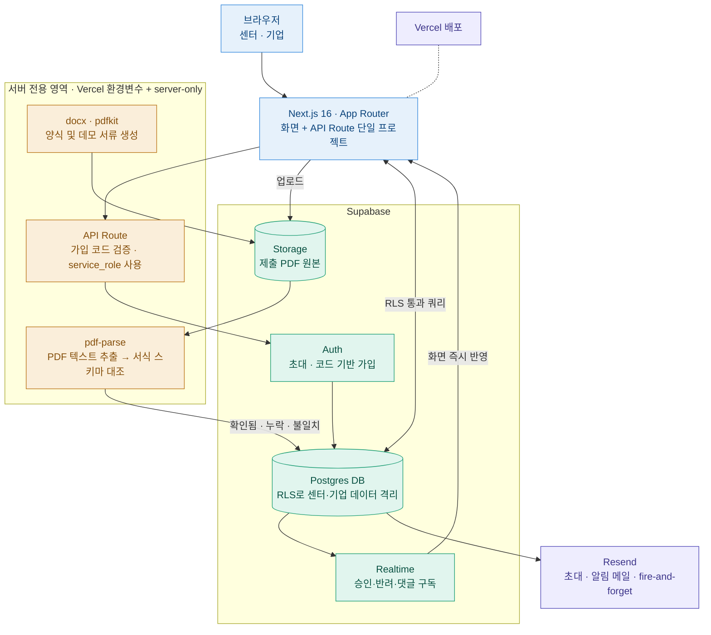

# 일학습병행 정보 미러링 대시보드
 
> 공동훈련센터와 참여기업 사이의 **정보 비대칭을 해소**하는 동시에, **서류 내용 검증을 통해 제출 요건 충족 여부를 실시간으로 확인**하는 일학습병행 서류관리 Tool입니다.
 
**🔗 라이브 데모** · https://hrdbridge.vercel.app/
**💻 데모 계정** · A사·B사·C사·센터 테스트계정 빠른 로그인 클릭
 
`Next.js` · `Supabase` · `Vercel` · `Resend` · `pdf-parse`
 
---
 
## Pain point


> **"기업은 서류를 공단 시스템에 직접 제출하지만, 기업을 대면 관리하는 센터는 그 내용을 볼 수 없는 정보 단절 구조
 
* **정보 비대칭** : 기업을 대면관리하는 센터는 기업의 시스템상 업로드를 볼 수 없음
* **다단계 소통구조** : 공단이 오류를 센터에 전달 - 센터는 기업에 자료 재확인/제출 요청 - 공단 시스템상 확인

---
 
## 해결 방안 
> **공단 시스템 제출 전, 기업의 제출 상태를 센터가 사전 확인(정보 미러링) & 상태/서류/소통을 단일화면(SSOT)으로 구성**
 
* **정보 미러링 (가시성)** : 센터와 기업이 진행 현황·승인 상태·이슈를 같은 화면에서 확인. 승인·반려·보완 요청이 실시간 반영)되고 이메일로도 통지되어, 확인 전화가 필요 없는 구조
* **3단계 서류 검증 (신뢰성)** : `파일명 매칭` → `문서 내용 확인` → `기준 서식 대조` 3단 검증으로 서류가 실제 요건을 충족하는지 확인하고, 공단 반려 이전에 누락·불일치를 사전 포착
* **역할 분리 및 접근 제한** : 센터와 기업의 권한을 분리하고, 셀프 가입을 차단해 사칭 경로를 제거. 센터 간에도 소속 기업만 조회 가능하도록 데이터 격리
---
 
## 핵심 설계 원칙 ① — 3단계 검증으로 형식적 제출 차단
 
```
① 파일명 매칭          ←→   ② 문서 내용 확인        ←→   ③ 기준 서식 대조
  "이름이 맞는 파일인가"      "실제 그 문서가 맞는가"        "필수 항목이 다 있는가"
      (1차 분류)                (PDF 텍스트 추출)            (서식 스키마 대비)
```
 
- **①** 기업명·과정명 키워드로 후보를 찾되, **확정 판단 근거로 쓰지 않음** 
- **②** PDF 텍스트를 추출해 문서 종류(사업계획서 vs 전담인력등록)가 실제로 맞는지 확인
- **③** 서식에 정의된 필수 항목이 본문에 존재하는지 대조
> 결과는 항상 **확인됨 / 누락 / 불일치** 3단계로만 리포트합니다. **AI가 자동 승인하지 않습니다** — 시스템은 대조 결과만 제시하고, 서류 적합성의 최종 판단은 담당자가 직접 합니다. 
 
## 핵심 설계 원칙 ② — 권한 수준에 따른 가입 통제 차등
 
```
   센터 (권한 강)              →      기업 (권한 약)
셀프가입 + 센터 가입 코드              센터 초대 전용
   (서버에서만 검증)                (셀프가입 경로 없음)
```
 
센터는 여러 기업 데이터를 열람하므로 코드 관문을, 기업은 센터를 통한 초대 경로를 열어 사칭을 원천 차단했습니다.
 
---
 
 
**테스트 방향**
1. 기업 담당자로 로그인 → `/my-company`에서 자료실 양식 다운로드 → 서류 PDF 첨부
2. 센터 담당자로 로그인 → `/companies`에서 해당 기업 상세 진입 → 3단계 검증 결과 확인
3. 반려 → 사유를 댓글로 전달 → 기업 화면에 실시간 반영 및 이메일 통지 확인
4. 재제출 → 승인 → 기업 포털에 "PDMS 바로가기" 배너 노출 확인
> 📧 셀프 회원가입은 차단되어 있습니다 — 기업 계정은 센터의 초대 메일로만 생성되며, 센터 계정은 가입 코드가 있어야 생성됩니다. 초대·가입 흐름은 아래 [화면](#주요-기능-및-화면)의 스크린샷으로 대체했습니다.
 
---
 
## 주요 기능 및 화면
 
* **필수서류 3단계 검증**
  파일명이 아닌 **문서 내용을 실제로 열어 확인**합니다. 필수 항목 누락 시 어떤 항목이 빠졌는지 지목해 보여주며, 자동 승인은 하지 않습니다.
| 검증 결과 (확인됨) | 검증 결과 (누락) | 검증 결과 (불일치) |
| :--- | :--- | :--- |
| *(스크린샷 추가 예정)* | *(스크린샷 추가 예정)* | *(스크린샷 추가 예정)* |
 
* **초대·코드 기반 가입**
  센터가 기업 담당자 이메일을 입력하면 초대 메일이 발송되고, 수락 시 role·company_id가 자동 부여됩니다. 센터 가입 코드는 서버(`/api/claim-center-role`)에서만 비교되어 브라우저에 노출되지 않습니다.
| 센터 가입 | 인적오류(이름 오기재) 방지 | 초대 메일 발송 | 초대 메일 확인 |초대링크 수락(페이지 생성)
| :--- | :--- | :--- |:--- |:--- |
| | | 
 |
 |

 
* **승인/반려 워크플로우 + 실시간 미러링**
  센터의 승인·반려가 기업 화면에 즉시 반영되고, 반려 사유가 댓글로 전달됩니다.
<details>
<summary>기능 상세 더보기</summary>
- **이슈 자동 감지** — 전담인력 **누락**(등록 서류 없음)과 **중복**(여러 과정이 같은 전담인력 파일 사용)을 자동 계산해 표시합니다.
- **서류 자료실** — 기업이 작성할 빈 양식은 편집 가능한 `.docx`로 제공합니다(PDF는 편집이 어려워 배제). 제출된 서류는 원본 그대로 다운로드해 PDMS에 바로 첨부할 수 있습니다.
- **이메일 알림** — 댓글 저장(INSERT) 시점에 해당 과정 → 기업 → 소속 센터를 조회해 "같은 회사 담당자 + 센터 담당자 전원"에게 발송하며, **작성자 본인은 항상 제외**합니다. 이메일 실패가 댓글 저장을 막지 않도록 fire-and-forget으로 처리했습니다.
- **센터 다중화** — `centers` 테이블로 센터별 소속 회사를 격리해, 신규 센터가 타 센터 데이터를 볼 수 없습니다.
- **데모 서류 생성** — 실제 PDMS 서식(표 테두리, 사업자등록번호, 제출일자·서명란)을 참고해 `scripts/generate-demo-pdfs.mjs`로 생성합니다.
</details>
---



## 기술 스택
 
| 기술 | 용도 / 선택 이유 |
|---|---|
| **Next.js 16** (App Router, TypeScript) | 화면(프론트엔드)과 백엔드(API 라우트)를 하나의 프로젝트로 다루는 풀스택 프레임워크 |
| **Supabase** (Auth/RLS/DB/Realtime/Storage) | 데이터를 저장하는 DB이면서, RLS를 통한 내부 통제 설계. 승인·댓글의 실시간 반영과 PDF 파일 저장까지 담당 |
| **Vercel** | 프로젝트 배포. 환경변수로 센터 가입 코드·service_role 키를 서버 전용으로 관리 |
| **Resend** | 기업 담당자 초대 메일, 댓글·승인/반려 알림 발송 |
| **pdf-parse** | 제출된 PDF에서 텍스트를 추출해 **2·3단계 내용 검증**에 사용. 파일명이 아닌 내용을 보는 근거 |
| **docx / pdfkit** | 자료실 빈 양식(.docx) 및 데모 서류(PDF)를 서식 스타일로 생성 |
| **server-only** | service_role 키·가입 코드 검증 로직이 실수로 클라이언트 번들에 섞이는 것을 **빌드 타임에 차단** |
 
---
 
## 보안 · 통제
 
배포된 서비스를 직접 점검하는 과정에서 접근통제 결함을 발견하고, **발견 → 원인 분석 → 통제 설계 → 검증** 순으로 조치했습니다.
 
* **화면 통제의 한계 확인:** 로그인 없이 URL 직접 입력만으로 전체 기업 데이터가 조회되는 것을 시크릿창 테스트로 확인.
* **DB 레벨 접근 통제 (RLS):** 화면 리다이렉트만으로는 API 직접 호출을 막을 수 없으므로, DB에서 권한과 데이터 격리를 강제.
* **가입 경로 자체를 통제:** RLS 정책의 실효성을 위해, 가입 시점에 검증된 초대/코드 소지자만 특정 역할 및 회사로 매핑되도록 재설계.
### 🛡️ 발견 및 조치 이력
 
| 문제 | 내용 | 조치 |
| :--- | :--- | :--- |
| **자동 센터 권한 부여** | 회원가입만 하면 자동으로 `role: center` 부여 → 전체 기업 데이터 열람 가능 | 가입 트리거 수정, 신규 가입자는 **권한 없음**으로 시작 |
| **`/setup` 사칭 경로** | 로그인 없이 누구나 "A/B/C사 담당자" 역할을 스스로 선택해 부여받을 수 있음 | 페이지 삭제, 초대 체계로 대체 |
| **셀프 회원가입 전체** | 이메일/비밀번호만으로 누구나 가입 가능 (Google OAuth 포함) | 셀프 가입·OAuth 제거, **초대/코드 기반**으로 전환 |
| **센터 페이지 role 미검증** | `/companies`가 로그인 여부만 확인하고 role은 안 봐서, 기업 계정도 URL만 알면 전체 열람 가능 | `role === 'center'` 검증 추가 |
| **로그아웃 후 데이터 잔존** | `signOut()`이 페이지 이동 없이 `router.refresh()`만 호출해 이전 화면 데이터가 남음 | `/login`으로 강제 이동 처리 |
| **센터 데이터 미격리** | 센터가 하나뿐이라 가정한 설계라, 신규 센터가 전체 회사 데이터를 봄 | `centers` 테이블 신설, **센터별 소속 회사로 격리** |
